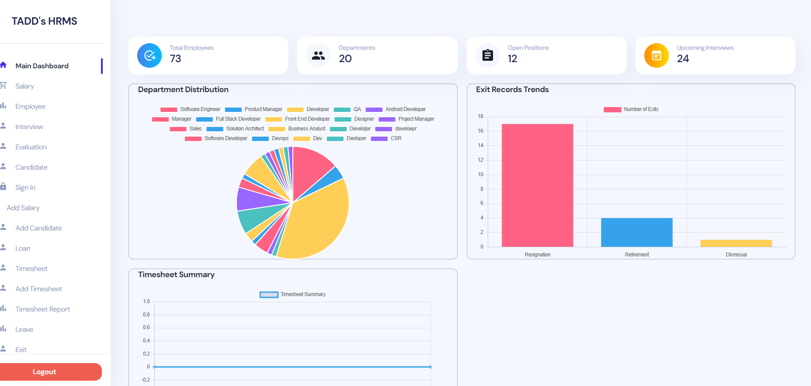

# HRMS Frontend



## 🚀 Introduction
Welcome to the **HRMS (Human Resource Management System) Frontend** repository. This is the frontend of an HRMS system that helps manage employees, track attendance, process leave requests, and handle user authentication.

## 🛠 Tech Stack
- **Frontend:** React.js, Redux (if applicable)
- **Styling:** CSS / TailwindCSS / Bootstrap (Specify if used)
- **Backend:** Node.js (Connected to this frontend)
- **Database:** MongoDB (Handled via backend)

## 🎯 Features
- ✅ Employee Management
- ✅ Attendance Tracking
- ✅ Leave Management
- ✅ User Authentication (Login/Register)
- ✅ Dashboard Analytics

## 📥 Installation & Setup
Follow these steps to set up the project locally:

### 1️⃣ Clone the Repository
```bash
git clone https://github.com/ArhamAhmed009/hrms-frontend.git
```

### 2️⃣ Navigate to Project Directory
```bash
cd hrms-frontend
```

### 3️⃣ Install Dependencies
```bash
npm install
```

### 4️⃣ Run the Project
```bash
npm start
```

This will start the development server on `http://localhost:3000` (by default).

## ⚙️ Environment Variables
Create a `.env` file in the root directory and configure necessary variables (if any):
```env
REACT_APP_API_URL=http://localhost:5000/api
```

## 🧩 Folder Structure
```
hrms-frontend/
│── src/
│   ├── components/      # Reusable UI components
│   ├── pages/           # Application pages
│   ├── assets/          # Images, Icons, etc.
│   ├── services/        # API calls and services
│   ├── hooks/           # Custom React hooks (if applicable)
│   ├── store/           # Redux store (if used)
│── public/
│── package.json
│── README.md
│── .env.example
```

## 🛡 Authentication & Authorization
- Uses **JWT-based authentication** (if applicable)
- Role-based access control (Admin, Employee, etc.)

## 🚀 Deployment
To deploy the project on a hosting platform (e.g., Vercel, Netlify):
```bash
npm run build
```
Then, follow the deployment instructions for your preferred hosting service.

## 🤝 Contributing
We welcome contributions! Follow these steps:
1. **Fork** the repository
2. **Create a new branch** (`feature-branch`)
3. **Commit your changes** (`git commit -m 'Added new feature'`)
4. **Push to your branch** (`git push origin feature-branch`)
5. **Create a Pull Request**

## 📄 License
This project is licensed under the **MIT License**.

## 📬 Contact
For any queries or issues, feel free to reach out:
- **GitHub:** [@ArhamAhmed009](https://github.com/ArhamAhmed009)
- **Email:** your-email@example.com (Replace with your email)

---
### 🌟 If you like this project, please ⭐ the repo!
---
